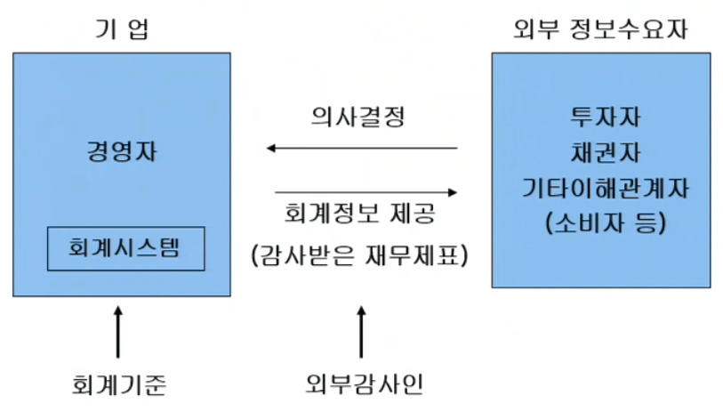
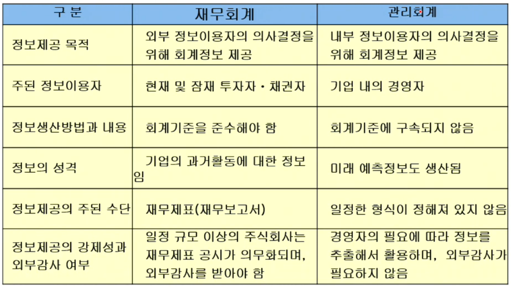
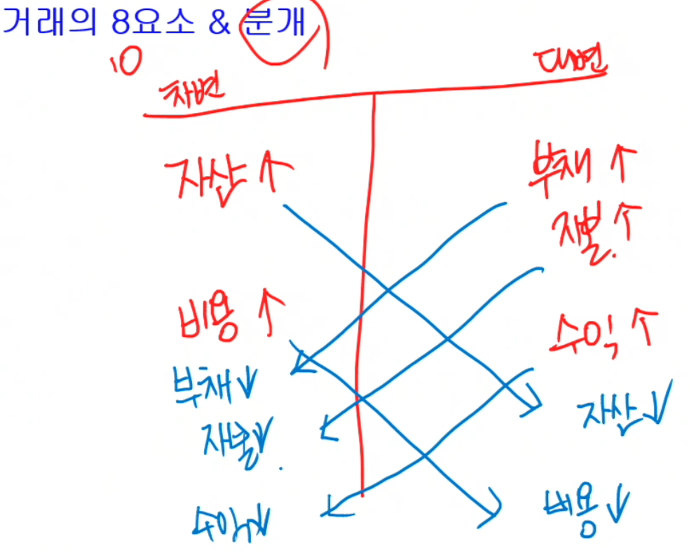

## 핀테크 파이썬

### 기존 강의 링크로 대체(일단)
[링크](https://github.com/hugoMGSung/basic-python-2024)

### 재무회계관리

#### 회계의 정의
- 기업에 대한 이해관계자들이 합리적 **의사결정**을 할 수 있게 하기위해 기업의 재무상태와 경영활동에 대한 정보를 측정하여 제공하는 정보생산체계(Information-generating System)
- 회계정보(Accounting Information) - 회계가 제공하는 정보

#### 회계원리
- 마케팅, 인사, 재무, 회계 등을 학습
- 경영학, 경제학 원론, 회계학, 통계(4개 기본)
- 잘먹고 잘살려면 돈이 필요함
	- 현재의 부자 - 부동산 등 나머지 자산을 빼고 현금 10억
	- 저축, 로또, 투자(주식, 채권 등), 부동산, 도박, 사업
	- 투자로 부자될 확률은 로또보다 높다
	- 사업을 하려면 경영을 해야 한다 -> 경영학과로 

- 사업을 하려면?
	- 아이템, 가게위치, 자본금, 공급업체, 종업원, 홍보...

- 개발자에게 회계란?
	- **돈과 관련된 것을 기록**해주는 것
	- 핀테크(금융 IT개발)을 할 수 있는 기반지식을 쌓고
	- 어려운 사업이 아닌 IT사업으로 돈을 벌 수 있게 하는 것

- 회계기록에 필요한건
	- 날짜, 금액(감가상각), 용도(계정과목)

- 회계를 잘하려면
	- 기준에 따라 표로 표시해줌
	- 재무상태표와 포괄손익계산서

- 재무상태표
|차변|대변|
|------|---|
|자산|남의돈=부채|
|(운용)|내돈=자본|

- 포괄손익계산서
|비용|수익|
|-----|---|

- 누가 회계를 이용하는가?
	1. 경영자
	2. 투자자(주주, 채권자)
	3. 정부(법인세 ㅋ)
	4. 은행
	5. 직원
	6. 소비자도...

#### 회계 정보의 수요와 공급
- 회계정보 제공 수단은? 재무제표(Financial Statements)

#### 경제주체와 회계정보의 역할
- 주식투자자와 회계정보의 역할
- 주식투자자 - 기업이 발행한 주식(stock)을 매수함으로써 기업에 자본을 투자
- 미래 투자수익(이익배당, 주가상승)과 투자위험을 평가하여 투자 여부 결정
	- 미래 투자수익의 크기는 투자대상기업의 미래 수익성에 달려있음
	- 이익률에 따라 기업의 좋고 나쁨을 따질 수 있음
	- 재무제표는 년도별 이익률도 봐야 함

- 채권자와 회계정보의 역할
	- 은행대출과 유사
	- 채권 - 회사이 재무제표를 보여주니 돈을 빌려달라, 언제까지 갚을게. 이자는 내가 결정할게
		- 3년동안 1억을 빌릴게 연이자 10%. 그럼 3번에 걸쳐서 이자 1000만원을 세번 나눠 지급하는 티켓을 발행
		- 3년째는 1억 1000만원을 주면 끝!
		- 채권은 1억 1000만원 이상으로 팔린다
		- 미래 채무이행능력이 있는지...

- 경영자와 회계정보의 역할
	- 기업의 여러 활동에 대한 계획을 수립하고 실행해 나가며, 이러한 과정이 경영의사결정의 연속
	- 사업 확대와 축소의 결정

- 회계정보는 자본공급자들이 우량기업을 구분하는데 도음

#### 회계기준
- 경영자가 기업활동을 측정하고 재무제표를 작성할 때 준수해야 할 규범
- 상장기업들에게 적용되는 회계기준 **한국채택국제회계기준(K-IFRS)** 로 제정
- 재무제표를 감사하는 외부감사인 - **공인회계사(CPA)**

#### 재무회계
- 회계원리(복식부기원리 및 재무제표작성)
- 중급회계(회계원리에서 회계순환은 제외)
- 고급회계(2개 이상의 기업의 재무제표 작성_연결, 합병, 지분법, 파생)

#### 기말수정분개 
- 현금주의 - 거래 후 실제돈이 들어오고 나오는 기준
- 발생주의 - 연말에 이자비용이 발생(!)했다고 보고 작성을 미리 해놓는 것(미지급비용(부채)) (예: 퇴직금)

#### 재고자산
- 계속기록법 - 물건 사고팔때마다 전부 기록 --> 
- 실지재고조사법 - 상품이 들어올땐 계속 기록만, 나갈때 팔린 비용 기록, 차후 재고조사 -->

#### 화폐의 시간가치 
- 현재가치(유효이자율법)
