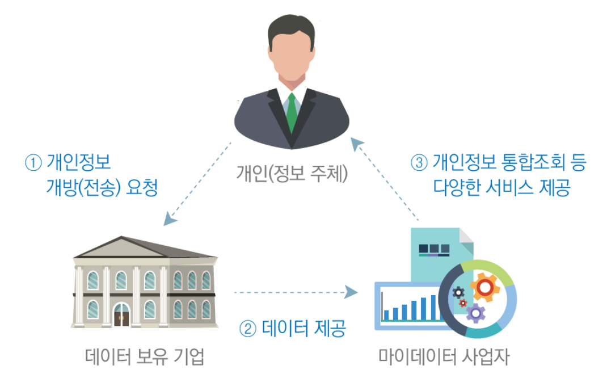
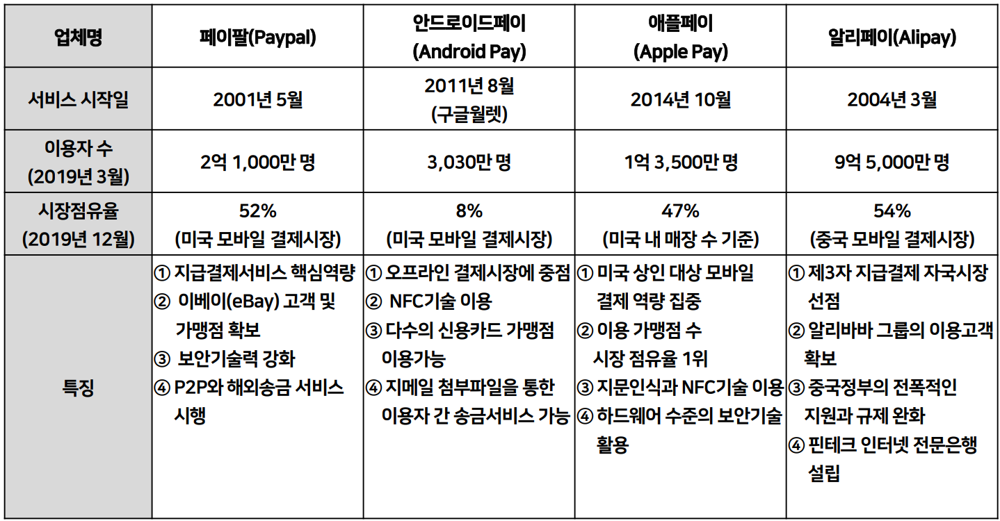

## 핀테크 파이썬

### 기존 강의 링크로 대체(일단)
[링크](https://github.com/hugoMGSung/basic-python-2024)

### 재무회계관리

#### 회계의 정의
- 기업에 대한 이해관계자들이 합리적 **의사결정**을 할 수 있게 하기위해 기업의 재무상태와 경영활동에 대한 정보를 측정하여 제공하는 정보생산체계(Information-generating System)
- 회계정보(Accounting Information) - 회계가 제공하는 정보

#### 회계원리
- 마케팅, 인사, 재무, 회계 등을 학습
- 경영학, 경제학 원론, 회계학, 통계(4개 기본)
- 잘먹고 잘살려면 돈이 필요함
	- 현재의 부자 - 부동산 등 나머지 자산을 빼고 현금 10억
	- 저축, 로또, 투자(주식, 채권 등), 부동산, 도박, 사업
	- 투자로 부자될 확률은 로또보다 높다
	- 사업을 하려면 경영을 해야 한다 -> 경영학과로 

- 사업을 하려면?
	- 아이템, 가게위치, 자본금, 공급업체, 종업원, 홍보...

- 개발자에게 회계란?
	- **돈과 관련된 것을 기록**해주는 것
	- 핀테크(금융 IT개발)을 할 수 있는 기반지식을 쌓고
	- 어려운 사업이 아닌 IT사업으로 돈을 벌 수 있게 하는 것

- 회계기록에 필요한건
	- 날짜, 금액(감가상각), 용도(계정과목)

- 회계를 잘하려면
	- 기준에 따라 표로 표시해줌
	- 재무상태표와 포괄손익계산서

- 재무상태표
|차변|대변|
|------|---|
|자산|남의돈=부채|
|(운용)|내돈=자본|

- 포괄손익계산서
|비용|수익|
|-----|---|

- 누가 회계를 이용하는가?
	1. 경영자
	2. 투자자(주주, 채권자)
	3. 정부(법인세 ㅋ)
	4. 은행
	5. 직원
	6. 소비자도...

#### 회계 정보의 수요와 공급
- 회계정보 제공 수단은? 재무제표(Financial Statements)

#### 경제주체와 회계정보의 역할
- 주식투자자와 회계정보의 역할
- 주식투자자 - 기업이 발행한 주식(stock)을 매수함으로써 기업에 자본을 투자
- 미래 투자수익(이익배당, 주가상승)과 투자위험을 평가하여 투자 여부 결정
	- 미래 투자수익의 크기는 투자대상기업의 미래 수익성에 달려있음
	- 이익률에 따라 기업의 좋고 나쁨을 따질 수 있음
	- 재무제표는 년도별 이익률도 봐야 함

- 채권자와 회계정보의 역할
	- 은행대출과 유사
	- 채권 - 회사이 재무제표를 보여주니 돈을 빌려달라, 언제까지 갚을게. 이자는 내가 결정할게
		- 3년동안 1억을 빌릴게 연이자 10%. 그럼 3번에 걸쳐서 이자 1000만원을 세번 나눠 지급하는 티켓을 발행
		- 3년째는 1억 1000만원을 주면 끝!
		- 채권은 1억 1000만원 이상으로 팔린다
		- 미래 채무이행능력이 있는지...

- 경영자와 회계정보의 역할
	- 기업의 여러 활동에 대한 계획을 수립하고 실행해 나가며, 이러한 과정이 경영의사결정의 연속
	- 사업 확대와 축소의 결정

- 회계정보는 자본공급자들이 우량기업을 구분하는데 도음

#### 회계기준
- 경영자가 기업활동을 측정하고 재무제표를 작성할 때 준수해야 할 규범
- 상장기업들에게 적용되는 회계기준 **한국채택국제회계기준(K-IFRS)** 로 제정
- 재무제표를 감사하는 외부감사인 - **공인회계사(CPA)**

#### 재무회계
- 회계원리(복식부기원리 및 재무제표작성)
- 중급회계(회계원리에서 회계순환은 제외)
- 고급회계(2개 이상의 기업의 재무제표 작성_연결, 합병, 지분법, 파생)

#### 기말수정분개 
- 현금주의 - 거래 후 실제돈이 들어오고 나오는 기준
- 발생주의 - 연말에 이자비용이 발생(!)했다고 보고 작성을 미리 해놓는 것(미지급비용(부채)) (예: 퇴직금)

#### 재고자산
- 계속기록법 - 물건 사고팔때마다 전부 기록 --> 
- 실지재고조사법 - 상품이 들어올땐 계속 기록만, 나갈때 팔린 비용 기록, 차후 재고조사 -->

#### 화폐의 시간가치 
- 현재가치(유효이자율법)

### 스마트 금융

#### 금융업의 혁신과 핀테크

- 인공지능(AI), 빅데이터(Big Data), 블록체인(Block Chain) 등 새로운 기술들이 적극적으로 활용되어 전통적인 금융업과는 다른 비즈니스가 전개되고 있음

- 전 세계적으로 정보기술(IT)과 금융의 융복합 트렌드가 확산되고 있으며, 그 중심이 핀테크(FinTech) 임

#### 금융 산업의 빅데이터 활용: 금융빅데이터분석

- 빅데이터의 잠재적 활용가치
	- 타 산업에 비해 금융 산업은 데이터의 보유량이 많고 빅데이터의 잠재적 활용가치가 높아 은행, 보험, 카드사를 중심으로 빅데이터 활용사례가 급증하고 있음

- 주로 고객과의 거래이력에 따라 시의 적절하게 판촉활동을 전개하는 고객관계관리(CRM)와 이벤트기반마케팅(event-based marketing, EBM)에 금융빅데이터 활용

#### 사례
1. 미국의 체이스뱅크(Chase Bank) - 계좌해약 조짐 패턴의 고객을 예측하여 특별 관리.
2. 일본 은행 - 신용카드 이용이력에 근거하여 빈번히 이용되는 점포의 쿠폰을 발송하는 거래이력에 기초한 쿠폰발급서비스 실시
3. 비자(VISA) - 고객 결제위치 및 시점, 구매품목과 구매이력을 실시간 파악, 주유소에서 결제를 마치면 인근 카페의 쿠폰을 발송하는 등 타깃 마케팅(target marketing) 실시

#### 한국신용정보원, AI 학습장(금융빅데이터 개방시스템)
- https://credb.kcredit.or.kr

#### 마이데이터
- https://www.mydatacenter.or.kr:3441
- 2020년 금융위원회와 금융감독원은 금융빅데이터분석 활성화를 위해 본인신용정보관리업(마이데이터 사업)을 추진
- 은행, 보험, 카드사 등이 보유한 개인신용정보를 손쉽게 관리할 수 있는 서비스. 제3자가 통합 및 관리하여 활용 

#### 사례
1. BC카드사
	- 경제활동인구 1인당 보유 신용카드 수가 늘어나면서 카드 사용빈도에 따른 빅데이터가 새로운 비즈니스 모델로 주목받고 있음
	- 카드사에는 언제, 어디서, 얼마를 사용했는지 알 수 있는 소비·결제데이터가 실시간으로 축적되고 있음
	- 지역·업종별 카드 거래 내역을 기반으로 대중교통이용빈도와 가맹점매출을 도출, 지역별 상권분석과 업종 폐업률을 분석
	- 금융빅데이터 플랫폼과 빅데이터 센터 구축 프로젝트를 수행
	- 고객들의 소비패턴을 분석하여 맞춤형 금융상품과 다양한 소비쿠폰을 제시하고 있음

### 핀테크 서비스

#### 개요
- FinTech : Financal(Finance) (ICT) Technology
	- 지급결제와 간편결제의 금융거래 및 결제서비스 혁신을 만들어가면서 다양한 수익모델 제공

##### 핀테크 1.0
- 말만들기
- (1866-1967) 아날로그에서 디지털로 변환. 전신 등 기술도입이시작. 금융업은 여전히 아날로그라고 인식

##### 핀테크 2.0
- (1967-2008) 간편결제, 송금, 펀드, 자산관리 등 기존 금융서비스를 IT와 결합하여 기존 금융서비스의 진화

##### 핀테크 3.0
- (2008- ) 혁신융합기술을 통해 기존 금융기관과 핀테크 기업과의 다양한 협업으로 온라인·모바일 환경에서 소비자 중심의 새로운 비즈니스 모델 창출 및 금융서비스 제공

#### 핀테크 서비스 기능별 분류
- 결제 및 송금, 대출 및 자금조달, 자산관리, 금융플랫폼

- 비즈니스 모델에 따른 분류
	- 지급결제(payments), 금융데이터분석(financial data analytics), 금융소프트웨어 시장(financial software market), 대출과 투자중개의 플랫폼(platforms) 등
- 협의의 핀테크
	- 핀테크는 간편결제를 포함한 지급결제서비스
- 광의의 핀테크
	-지급결제를 포함한 금융SW 솔루션, 플랫폼을 개발하기 위한 기술/의사결정, 위험관리, 포트폴리오 재구성, 성과관리, 시스템 통합 등

#### 핀테크 서비스 활성화 방안 연구
- 핀테크 시장의 활성화 방안을 찾기위해 전문가 인터뷰 실시
- 금융기관 핀테크 담당자, 핀테크 스타트업 실무자, 핀테크 비즈니스 모델 전문가, 핀테크 보안 전문가, 그리고 핀테크 관련 연구자 등을 대상으로 심층면접조사를 수행함.
- 주요 심층면접 질의내용: 국내외 핀테크 시장의 현황 진단, 핀테크 법적과제, 핀테크 관련 정책적, 제도적, 기술적 요소 등

1. 관련 법적규제 완화와 산업 생태계에 적합한 법 제정 필요성 주장
	- 전문가들은 정부 및 정책기관에서 열거한 업무만 제한적으로 할 수 있는 포지티브(positive) 방식 규제에서 벗어나, 금융당국이 금지하는 특정 업무만 제외하면 나머지는 자유롭게 할 수 있도록 허용하는 네거티브(negative) 방식의 규제 전환이 필요하다고 주장
2. 국내 핀테크 환경에 적합한 내부통제(internal control)및 보안 거너넌스(security governance)의 필요성 주장
	- 핀테크 보안 거버넌스는 기관 간 협의된 표준화된 핀테크 보안정책 수립, 정보보호에 관한 최고경영층의 의사결정권한과 책임수립, 비즈니스와의 전략적 연계, 법령 보장
3. 핀테크 이용자 인증방법 중 생체인증과 데이터보호방식 중 하나인 블록체인의 기술력 향상이 중요
	- 이들 기술의 국제표준화를 위한 노력이 필요함
	- 생체인증과 블록체인 기술 관련 스타트업 기업을 육성하고 이들 핵심기술의 세계 시장 선점을 위해 국제표준화 노력 필요
4. 핀테크 스타트업 생태계 조성의 중요성 주장
	- 정부 및 정책기관뿐 아니라 국내 금융기관들도 [로보어드바이저](https://namu.wiki/w/%EB%A1%9C%EB%B3%B4%EC%96%B4%EB%93%9C%EB%B0%94%EC%9D%B4%EC%A0%80), P2P금융, 금융빅데이터분석 등 핀테크 영역에 진입하려는 스타트업 기업을 위한 지속적인 사업화 지원, 혁신적 창업자 양성, 신사업 발굴지원 등을 통해 상생 생태계 구축 필요
5. 전문가들은 생체인증 및 블록체인 기술 전문가, 핀테크 빅데이터 분석가, 핀테크 보안 전문가, 로보어드바이저 개발자 등의 핀테크 전문인력양성이 필요하다고 주장

#### 인터넷 전문은행 개요
- 핀테크 서비스의 대표적인 비즈니스 모델: 인터넷 전문은행(Internet Primary Bank)
- 인터넷과 모바일, 현금자동입출금기(ATM), 콜센터 등 비대면 인증방식으로 금융서비스를 제공하는 무점포은행
- 지점방문이 필요없는 비대면계좌개설 및 자금이체서비스, 시중은행 대비 높은 예금금리와 낮은 대출금리, 저렴한 수수료 등을 내세워 시중은행과 차별화된 전략을 내세우고 있음
- 미국과 유럽은 1990년대부터, 일본은 2000년대부터 금융 산업의 경쟁력 강화와 소비자 편익증대를 위해 인터넷 전문은행 도입·운영함

- 국내 최초 인터넷전문은행: 케이뱅크(제1호), 카카오뱅크(제2호)가 2017년에 출범 후 영업 개시
	- 금융빅데이터 기반의 신용등급평과와 이를 반영한 중금리 대출 등 ICT기반의 차별화된 금융서비스를 제공하고 있음
	- 설립 초기 국내 인터넷 전문은행은 은산분리(銀産分離)규제로 인해 혁신적인 서비스 제공이 현실적으로 어려운 상황에 직면함
	- 은산분리: 비금융주력자(산업자본)의 의결권이 있는 은행 주식 보유한도를 4%로 제한하고,의결권 없는 주식 6%를 추가로 보유할 수 있어 최대 10%까지 제한하는 규제

- 2018년 9월에 인터넷전문은행 설립 및 운영에 관한 특례법(이하 인터넷전문은행특례법)이 국회 본회의(本會議)에 통과되면서 ICT대기업에 한해 의결권 지분을 최대 34%(기존 4%, 의결권 기준)까지 늘릴 수 있는 여건이 마련
- 인터넷전문은행은 점포 운영비와 인건비 등이 최소화되므로 시중은행보다 예금금리를 높이거나 대출금리를 낮출 수 있는 여력이 있음
- 국내외 인터넷전문은행이 핵심서비스로 중금리 대출을 내세우고 있어 중금리 신용대출 활성화가 기대되고 있음

- 케이뱅크 1위, 카카오뱅크 2위, 토스뱅크 3위 2024년 3월 기준 [링크](https://www.cbci.co.kr/news/articleView.html?idxno=463011)